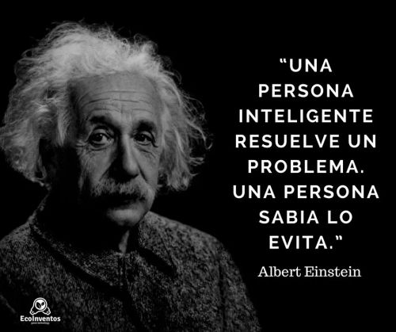

# sesion-01

2026-08-12

primera clase

## ¿qué es la información?

conjunto de datos, adecuadamente agrupado y con ua estructura, orden y organización.

## toma de decisiones

La supervivencia de una organización depende la inteligencia con que los gerentes tomen las decisiones.

Las estrategias de negocios requieren conocimiento.

## ¿qué es la mercadotecnia?

Es un “conjunto de principios y prácticas que buscan el aumento del comercio, especialmente de la demanda”, explica la Real Academia Española (RAE).

**La columna vertebral del marketing, es la creación de valor.**

## ¿qué es una marca?

La marca es el conjunto de atributos tangibles e intangibles que identifican un producto o servicio y lo hacen único.

## ¿cuál es la diferencia entre branding y mercadotecnia?

el branding es la base, es tu identidad: tus valores, tu tono y la percepción general que quieres que la gente tenga.

El marketing es cómo comunicas esa identidad para obtener resultados.

## conceptos mencionados

- [Albert Einstein](https://es.wikipedia.org/wiki/Albert_Einstein)
- [Teoría de la relatividad](https://es.wikipedia.org/wiki/Teor%C3%ADa_de_la_relatividad)
- [Pirámide de Maslow](https://es.wikipedia.org/wiki/Pir%C3%A1mide_de_Maslow)
- [Pavlov, Condicionamiento Operante](https://es.wikipedia.org/wiki/Condicionamiento_cl%C3%A1sico)